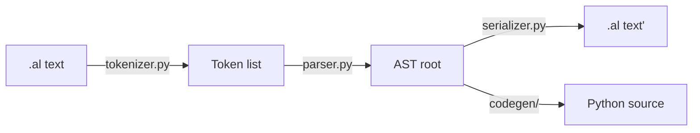

# Parser 内部设计

> Python 实现。手写递归下降。AST 在 `src/al/parser/ast_nodes.py` 是公共契约。

---

## 1. 总流程



---

## 2. Tokenizer

`src/al/parser/tokenizer.py`

**线性 / 行级 / 缩进感知**。一次 pass 把源切成 token 流。每个 token 携带 `(kind, text, line, col, indent)`。

Token 种类：

| kind | 说明 | 例 |
|---|---|---|
| `DECL` | 顶层声明符 | `flow`, `agent`, `code`, `set` |
| `IDENT` | 标识符 | `daily_news` |
| `COLON` | 字段分隔 | `:` |
| `INLINE_VALUE` | 字段冒号后到行尾的内联值 | `top news, deduped` |
| `BLOCK_SCALAR_OPEN` | `\|` 标记 | `|` |
| `BLOCK_SCALAR_BODY` | 紧随的多行文本块 | `import feedparser\n...` |
| `LIST_ITEM` | `- ` 起头 | `- fetch_sources` |
| `CONTROL` | parallel / each / if / else | `parallel:` |
| `COMMENT` | `# ...` | `# 单元注释` |
| `NEWLINE` | 行结束 | |
| `INDENT` / `DEDENT` | 缩进变化 | |
| `EOF` | 文件结束 | |

特殊处理：

- **block scalar 捕获**：遇 `|` 后，所有 indent > 引入行的连续行都吞进 BLOCK_SCALAR_BODY，按最小公共缩进 dedent。
- **注释**：以 `#` 开头到行尾舍弃；保留 token 不参与语义但 serializer 可重建（v1 不强求）。
- **Tab 检测**：tab 出现立即 `LexError`（spec 禁用）。

---

## 3. Parser

`src/al/parser/parser.py`

手写递归下降，符合一篇 spec 4 节的 grammar。函数命名 `parse_<rule>` 一一对应：

```
parse_program       → 顶层定义列表
parse_definition    → flow|agent|code|set <name>: ... 的整体
parse_field         → 一个字段（inline / block scalar / nested / list）
parse_field_value   → 字段右侧值（5 种 FieldValue 类型之一）
parse_step_list     → steps: 下的项目列表
parse_step_item     → 单个 step（ref / parallel / each / if-else）
parse_field_group   → 嵌套的 key: value 块
parse_block_scalar  → 已由 tokenizer 捕获 body，这里只包装为 AST 节点
```

错误处理：parser 抛 `al.parser.errors.ParseError` 携带 `(line, col, message, expected)`。CLI 把 ParseError 渲染成带源码上下文的提示。

---

## 4. AST

`src/al/parser/ast_nodes.py` — 全部 dataclass，frozen=False（serializer 可能需要修订），含 `loc: Loc`。

```python
@dataclass
class Program:
    defs: list[Definition]
    loc: Loc

@dataclass
class Definition:
    kind: Literal["flow", "code", "agent", "set"]
    name: str
    fields: list[Field]    # 顺序保留
    loc: Loc

@dataclass
class Field:
    name: str
    value: FieldValue
    loc: Loc

# FieldValue 是 Union 类型
class FieldValue: ...
@dataclass
class InlineText(FieldValue):  text: str; loc: Loc
@dataclass
class BlockScalar(FieldValue): text: str; loc: Loc
@dataclass
class FieldGroup(FieldValue):  fields: list[Field]; loc: Loc
@dataclass
class StepList(FieldValue):    items: list[StepItem]; loc: Loc
@dataclass
class Reference(FieldValue):   name: str; loc: Loc
@dataclass
class ReferenceList(FieldValue): names: list[str]; loc: Loc   # 新增 v0.6：tools/skills/extensions/use 多值

# StepItem
class StepItem: ...
@dataclass
class RefStep(StepItem):      name: str; loc: Loc
@dataclass
class ParallelStep(StepItem): items: list[StepItem]; loc: Loc
@dataclass
class EachStep(StepItem):     binding: str; items: list[StepItem]; loc: Loc
@dataclass
class IfStep(StepItem):       cond: str; then: list[StepItem]; else_: list[StepItem] | None; loc: Loc
```

**Field 名 → FieldValue 类型映射**（parser 内的查表逻辑）：

| 字段名 | 默认 FieldValue 类型 |
|---|---|
| `intent`, `schedule` | InlineText |
| `prompt`, `body`, `memory` | BlockScalar |
| `input`, `output` | InlineText 或 FieldGroup（看缩进） |
| `steps` | StepList |
| `fallback` | Reference |
| `use` | Reference（单值）或 ReferenceList（列表） |
| `tools`, `skills`, `extensions` | ReferenceList |

---

## 5. Serializer

`src/al/parser/serializer.py`

AST → 文本。规范化输出（canonical form）：

- 字段顺序按 spec 推荐顺序：`intent` 第一，然后 `schedule`，然后其它声明性字段，最后 `steps` / `body` / `prompt` / `memory`。
- block scalar 按 2 空格缩进重排。
- list item 按 `- ` + 后续按 +4 空格缩进。
- 顶层定义之间空 2 行。

**roundtrip 保证**：`parse(serialize(parse(x))) == parse(x)`（AST 等价，不强求字节等价）。

---

## 6. 与 v0.5 JS parser 的差异

v0.5 JS parser 已归档在 `archive/legacy-jsx-prototype/packages-parser-js/`。Python 版相对它：

| 维度 | v0.5 JS | v0.6 Python |
|---|---|---|
| 语言 | JavaScript ESM | Python 3.11+ dataclass |
| 节点种类 | 3（flow/code/agent） | 4（+ set） |
| AST FieldValue | 5 种 | 6 种（+ ReferenceList） |
| `use` / `tools` 等字段 | 不支持 | 支持 |
| Loc 1-indexed | ✅ | ✅（保持兼容，方便编辑器对接） |
| 错误类 | Error 子类 | ParseError dataclass |

---

## 7. 性能与 [UPGRADE] 项

v1 不追求性能。已知低效点：

- 每次 parse 都从头扫描，无缓存（`# [UPGRADE] cache by file mtime`）
- block scalar 用 list join，大文件慢（`# [UPGRADE] StringIO`）
- 错误恢复：第一个错误就 abort，不做"找回最近合法位置继续"（`# [UPGRADE] error recovery`）

---

## 8. 测试矩阵

见 `tests/parser/`。目标覆盖（阶段 ①  退出条件）：

- tokenize_basic
- parse_flow_with_steps（含 parallel/each/if-else）
- parse_set_node（v0.6 新增）
- parse_agent_with_use（v0.6 新增）
- serialize_roundtrip（AST 等价）

阶段 ② 加：负面测试（错误信息正确性）、大文件性能 smoke。
