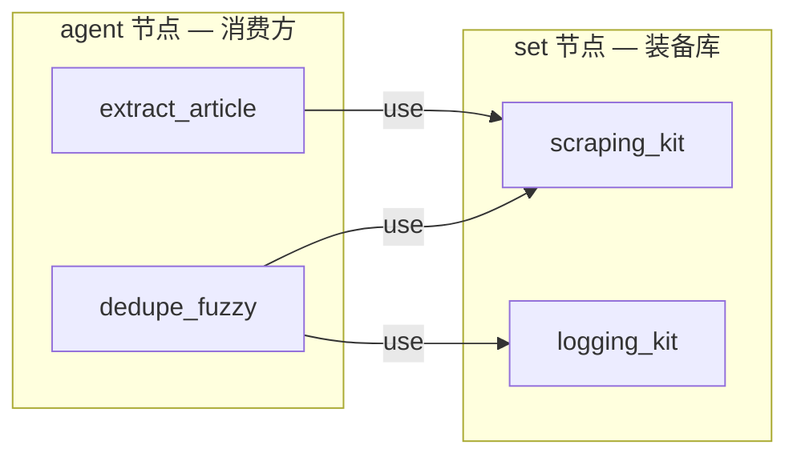
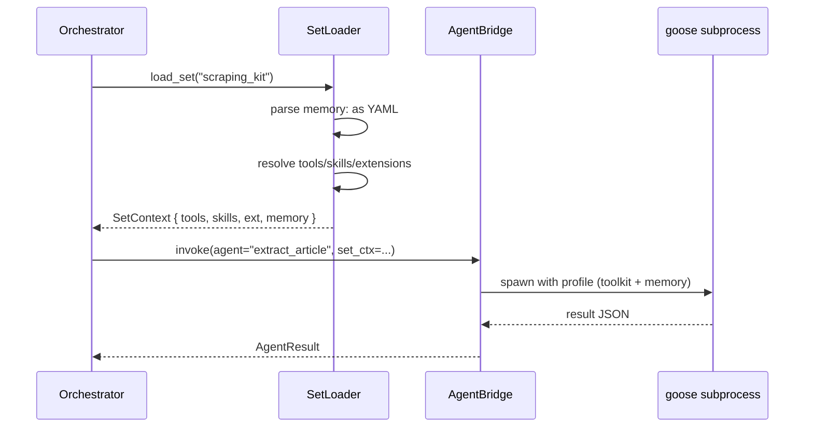

# `set` 节点设计动机

> 为什么 v0.6 引入第四类节点 `set`，它解决什么问题，与现有三类节点的边界，以及对应的 runtime 行为。

---

## 1. 引入动机

v0.5 spec 里只有三种节点（`flow` / `code` / `agent`），agent 节点的 prompt 字段把"该怎么调用工具"和"该工具有什么"混在一起描述。当多个 agent 需要共用同一组工具 / MCP 服务 / 已学习状态时，没有自然的位置放它们。

具体痛点（来自 v0.5 prototype 的 daily_news 案例）：

- `extract_article` 需要 fetch、readability fallback、jsonld 抽取、归一日期等一组能力；
- `dedupe_fuzzy` 也用其中一部分（fetch_url、normalize_dates）；
- 这些能力的"实现入口"分散在多个地方，agent 之间复用要么靠 prompt 复制粘贴，要么靠运行时硬编码，没有声明性的 surface。

**v0.6 加入 `set`**，把"agent 的装备槽"显式化：



---

## 2. 与 goose 模型的对应

agent-lang 的 agent 节点本质是 goose 调用：

| goose 概念 | agent-lang 表达 |
|---|---|
| Agent | `agent <name>:` |
| Toolkit / Tool | `set` 中的 `tools:` |
| Skill / 提示工程 | `set` 中的 `skills:` |
| MCP server | `set` 中的 `extensions:` |
| Agent 持久状态 | `set` 中的 `memory:` |

这意味着 **`set` ≈ goose 的 agent profile / toolkit 配置**，但暴露为可被多个 agent 引用的命名实体。

---

## 3. set vs code vs flow vs agent

| 维度 | flow | code | agent | **set** |
|---|---|---|---|---|
| 是否参与执行流 | ✅ 编排子节点 | ✅ 跑 Python | ✅ 调 LLM | **❌ 只被引用** |
| 是否可被 `steps:` 引用 | ✅ | ✅ | ✅ | **❌**（不是步骤） |
| 是否可被 `agent.use:` 引用 | ❌ | ❌ | ❌ | **✅** |
| 是否可有子节点 | ✅ | ❌（叶子） | ✅（编排子 agent） | **❌**（不是容器） |
| 主体字段 | `steps:` | `body:` | `prompt:` | `tools:` / `skills:` / `extensions:` / `memory:` |

`set` 本质上是**资源声明**，类比：

- 类比 1：Python 中的 module（导入而非执行）
- 类比 2：Docker 中的 base image（被多个容器复用，自身不跑）
- 类比 3：游戏中的"装备包"（角色装备它就获得相应能力）

---

## 4. 字段语义

### 4.1 `tools:`

工具引用列表。每个引用按下面顺序解析：

1. 是否是 `mcp/<server>/<tool>` 形式 → MCP 工具
2. 是否在当前文件内有同名 `code` 节点 → 视为本地实现
3. 否则查 runtime 内置工具表（`fetch_url`, `read_file` 等基础工具）
4. 都没找到 → parser warning（不是 error，因为运行时可能注入）

### 4.2 `skills:`

可复用 skill 引用列表。语义上比 tool 更高层（多个步骤的组合 / prompt 模式）。v1 实现先简化为"命名 prompt 片段"——runtime 加载时把 skill 内容拼到 agent 上下文。

未来（v2+）：skill 自身可能升级为完整的 sub-agent。

### 4.3 `extensions:`

MCP 服务器列表，约定 `mcp/<server-name>` 形式。runtime 在 agent 调用前确保对应 MCP server 已启动并连接。

### 4.4 `memory:`

block scalar，YAML 兼容。runtime 解析为 dict 注入 agent 上下文。**v1 是只读注入**；持久写回（"learned at runtime, persisted across calls"）是阶段 ②  末期 / 阶段 ③ 的事——需要决定持久化后端（文件 / sqlite / 远端）。

---

## 5. agent 引用 set 的形态

### 5.1 单值

```al
agent extract_article:
  use: scraping_kit
```

### 5.2 列表

```al
agent extract_article:
  use:
    - scraping_kit
    - logging_kit
```

### 5.3 合并语义

多个 set 按声明顺序合并：

- `tools` / `skills` / `extensions`：列表 union（去重，保留出现顺序）
- `memory`：YAML 字典深度合并（后面的 set 中的同 key 覆盖前面）

冲突由 parser 静态检测：同名 tool 在两个 set 中实现不一致 → warning。

---

## 6. runtime 行为（阶段 ②  实现）



关键点：

- SetLoader 是无状态的（v1）；每次调用重新解析（性能优化是 [UPGRADE]）。
- AgentBridge 不直接执行工具——把工具列表作为 goose toolkit 配置传过去；goose 内部决定调用哪个工具。
- `memory:` 在 v1 注入为 goose 的 system context；v2 才考虑持久化。

---

## 7. codegen 行为（阶段 ①  骨架；阶段 ② 完整实现）

`set` 节点 → 生成一个 Python 模块，定义形如：

```python
# generated by al.codegen.emit_set
SCRAPING_KIT = SetDefinition(
    name="scraping_kit",
    intent="reusable bundle for agents that read messy HTML",
    tools=["fetch_url", "readability_js", "html_to_markdown"],
    skills=["extract_jsonld", "normalize_dates"],
    extensions=["mcp/playwright", "mcp/serpapi"],
    memory={
        "site_selectors": {...},
        "paywall_domains": [...],
    },
)
```

agent 节点的 `use:` 编译为 `agent_call(..., sets=[SCRAPING_KIT])`。

---

## 8. 为什么不是 4 个独立节点（`tool` / `skill` / `extension` / `memory`）

考虑过把 4 个字段拆成 4 类节点。否决理由：

1. **使用频率不对称**：tool 多、skill 中、extension 少、memory 少。给每个字段一个顶层节点会让小文件膨胀。
2. **聚合是基本单位**：实际开发中 agent 总是装备"一组"工具，不会单独装一个 tool；`set` 反映了这个聚合本质。
3. **命名清晰**：`set scraping_kit` 比 `toolset scraping_kit + skillset scraping_kit + ...` 自然得多。
4. **AST 简单**：4 类顶层节点 + 一个新字段 `use:`，比 7 类顶层节点更轻。

---

## 9. 已知开放问题（v0.6 后续 RFC）

| # | 问题 | 当前默认 |
|---|---|---|
| Q1 | `memory:` 持久化后端？ | 文件 (YAML)，路径 `<workspace>/.al/memory/<set_name>.yaml` |
| Q2 | tool 名字命名空间冲突如何处理？ | warning + 后定义覆盖前定义 |
| Q3 | 是否允许 `set` 引用 `set`（递归装备）？ | v1 不允许，v2 重新评估 |
| Q4 | flow / code 节点能否 `use: <set>`？ | 否；只有 agent 能 use |
| Q5 | runtime 内置 tool 表的完整名单 | 阶段 ② 锁定，初步包含 fetch_url / read_file / write_file / shell_exec |

这些标记为 `[TODO Q<n>]`，在 `src/al/parser/parser.py` 和 `src/al/runtime/set_loader.py` 中追踪。
